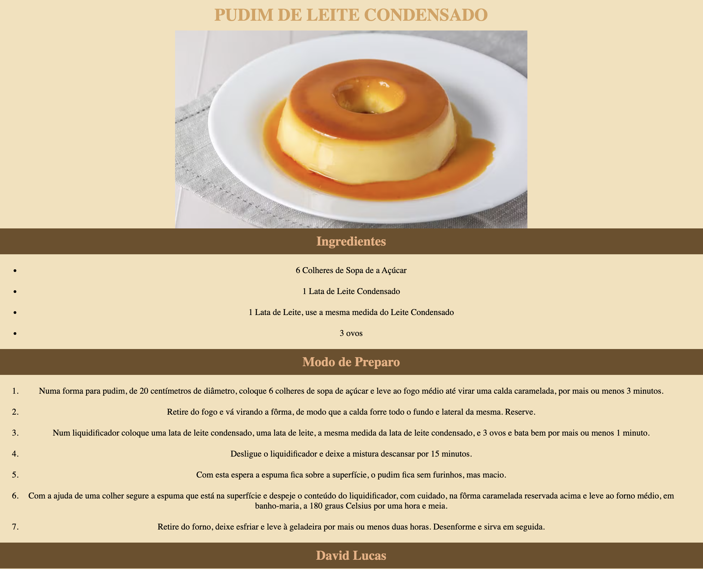

# receitas

Este projeto foi desenvolvido como parte de um exercício de treinamento em HTML e CSS. A proposta é criar um site de receitas simples, com foco na construção de páginas web bem estruturadas. A aplicação demonstra o uso básico dessas tecnologias para desenvolver layouts limpos e funcionais.

## Tecnologias
* HTML
* CSS

## Autor
[David Lucas](<https://www.linkedin.com/in/david-lucas-19370727b/>)